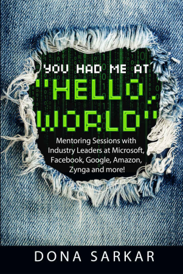
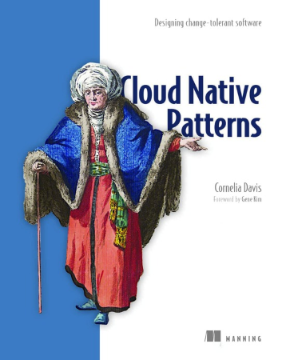
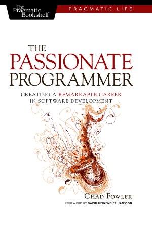

These are the most essential books of on the craft of Software Engineering that I've discovered thus far. I will update the list as I discover more.

    

        
         
        <a href="https://www.amazon.com/Pragmatic-Programmer-journey-mastery-Anniversary/dp/0135957052">Amazon</a> &nbsp;&nbsp; 
        <a href="https://learning.oreilly.com/library/view/the-pragmatic-programmer/9780135956977/">O'Reilly Learning</a>
    

    

        
         
        <a href="https://www.amazon.com/You-Had-Hello-World-Mentoring/dp/0996731113">Amazon</a>
    

    

        
         
        <a href="https://www.amazon.com/Cloud-Native-Designing-change-tolerant-software/dp/1617294292">Amazon</a> &nbsp;&nbsp;<a href="https://learning.oreilly.com/library/view/cloud-native-patterns/9781617294297">O'Reilly Learning</a>
    

        
         
        <a href="https://www.amazon.com/Passionate-Programmer-Remarkable-Development-Pragmatic-dp-1934356344/dp/1934356344">Amazon</a> &nbsp;&nbsp;<a href="https://learning.oreilly.com/library/view/the-passionate-programmer/9781680500165">O'Reilly Learning</a>
    

